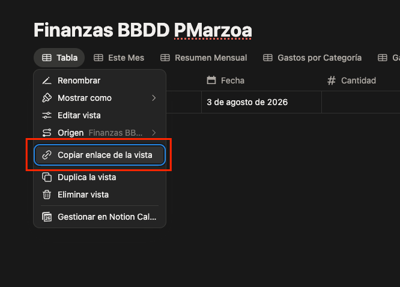

# Notion Financial Status

Aplicación Angular para el control, análisis y gestión de finanzas personales sincronizada en tiempo real con Notion.

---

## ⚙️ Guía de Configuración Inicial con Notion

Si estás viendo la aplicación en **Modo Demo**, sigue estos 3 sencillos pasos para vincular tu propia base de datos:

---

### Paso 1: Crear la Base de Datos en Notion

Tienes dos formas de disponer de la plantilla de base de datos necesaria:

- **Opción A (Recomendada - Duplicar Plantilla Online)**:  
  Abre la [Base de Datos Publicada en Notion](https://discreet-firewall-1fb.notion.site/f7a4e723375b825cb30481df2c173df4?v=7e34e723375b82f180710812190339f6&source=copy_link) y pulsa en el botón superior derecho **Duplicar** para clonarla en tu propio espacio de trabajo.
- **Opción B (Importar archivo ZIP)**:  
  Descarga el archivo [bbdd-notion.zip](./BBDD/bbdd-notion.zip) de la carpeta `BBDD` de este repositorio e impórtalo directamente en tu Notion.

---

### Paso 2: Crear tu Token Personal de Acceso (API Key)

Para que la aplicación pueda leer y escribir tus movimientos, necesitas un token de integración:

1. Accede a [Notion Developers - Integraciones / Tokens](https://www.notion.so/profile/integrations).
2. Sigue los pasos oficiales descritos en la [Guía de Personal Access Tokens de Notion](https://developers.notion.com/guides/get-started/personal-access-tokens) para crear una nueva integración interna (por ejemplo, llamada `Control Finanzas`).
3. Copia el **Internal Integration Secret (API Token)** que comienza por `secret_...` o `ntn_...`.
4. En tu Notion, abre la base de datos que creaste en el **Paso 1**, haz clic en el menú `...` (arriba a la derecha) > **Conexiones** (Connections) y conecta la integración recién creada.

---

### Paso 3: Obtener el ID de tu Base de Datos

Para localizar el **Database ID** de tu base de datos en Notion:

1. En la pestaña de la tabla o vista de tu base de datos, haz clic en el menú contextual de la vista y selecciona **"Copiar enlace de la vista"**:

   

2. Pega el enlace copiado en cualquier lugar para inspeccionarlo. Verás una URL con el siguiente formato:
   `https://app.notion.com/p/f7a4e723375b825cb30481df2c173df4?v=7e34e723375b82f180710812190339f6&source=copy_link`

3. Tu **Database ID** es la cadena de 32 caracteres que se encuentra inmediatamente después de `/p/` (o después de tu workspace) y antes de los parámetros `?v=...`:

   

---

### Paso 4: Introducir Credenciales en la Aplicación

1. En la barra superior de la app, haz clic en el botón **Configurar Notion** (o **Configurar Ahora** en el banner del modo demo).
2. Pega tu **API Token** y tu **Database ID**.
3. Guarda los cambios. ¡La aplicación cargará tus datos reales automáticamente!

---

## 🚀 Despliegue en Docker

### Opción 1: Docker CLI

```bash
docker run -d \
  --name financial-status \
  --restart unless-stopped \
  -p 9090:8080 \
  pmarzoa/notion-financial-status:latest
```

### Opción 2: Docker Compose

```yaml
version: '3.8'

services:
  financial-status:
    image: pmarzoa/notion-financial-status:latest
    container_name: financial-status
    restart: unless-stopped
    ports:
      - "9090:8080"
```